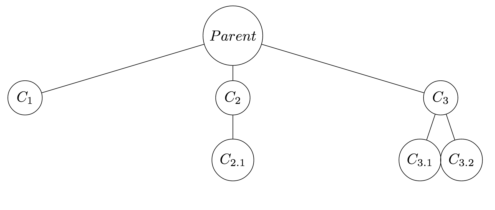

# Shi Zeng sz1358 Homework 2

## Question 1
1. 5 processes.
2. 

    * C1: i = 0
    * C2: i = 1
    * C2-1: j = 0
    * C3: i = 2
    * C3-1: j = 1
    * C3-2: j = 2
3. See trace.c

## Question 2
See decoder.c

## Question 3
